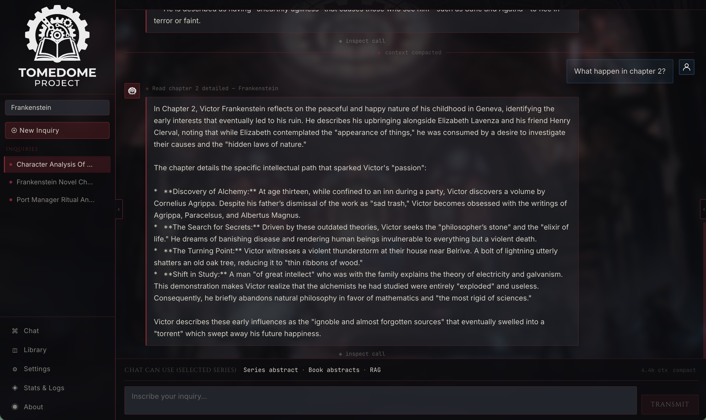
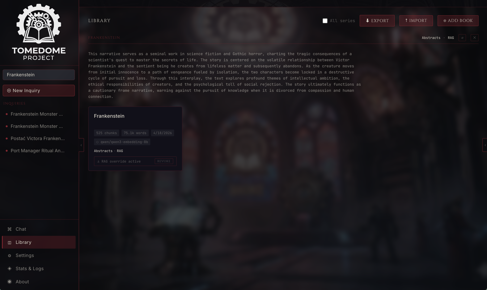
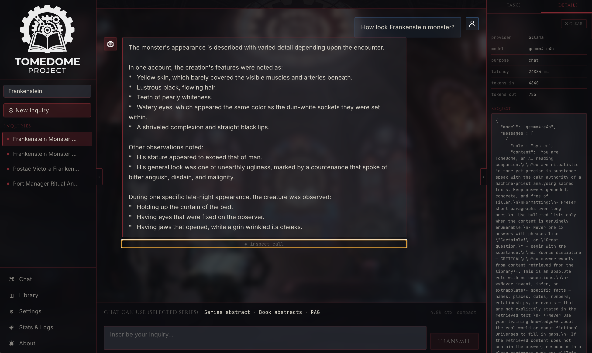
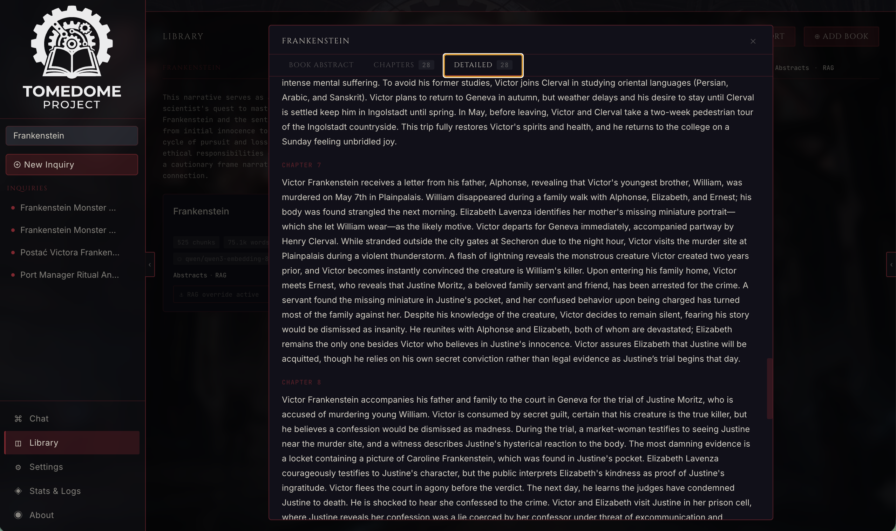
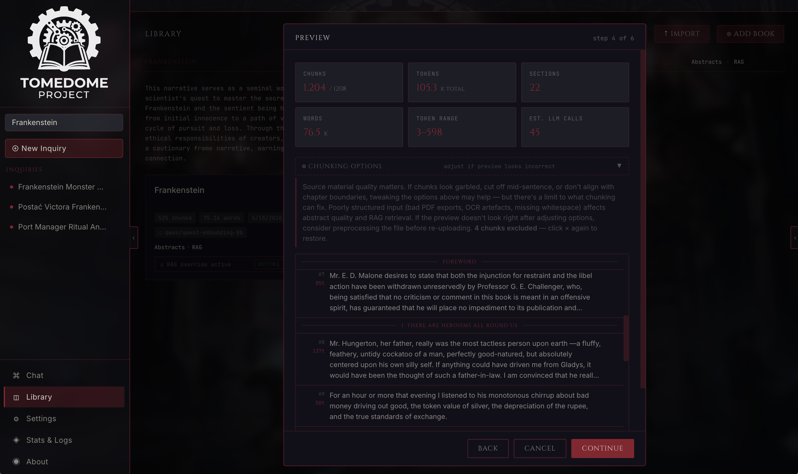
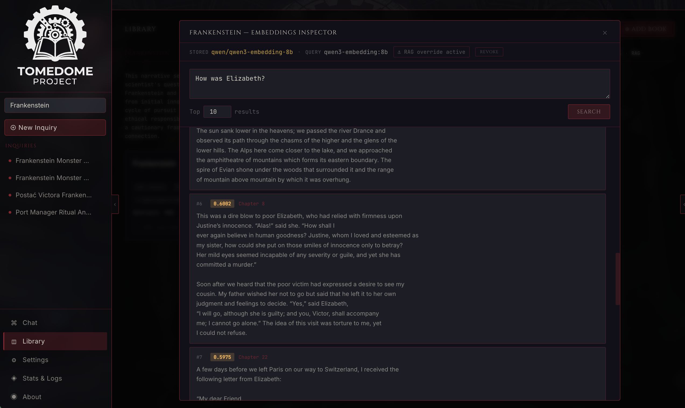
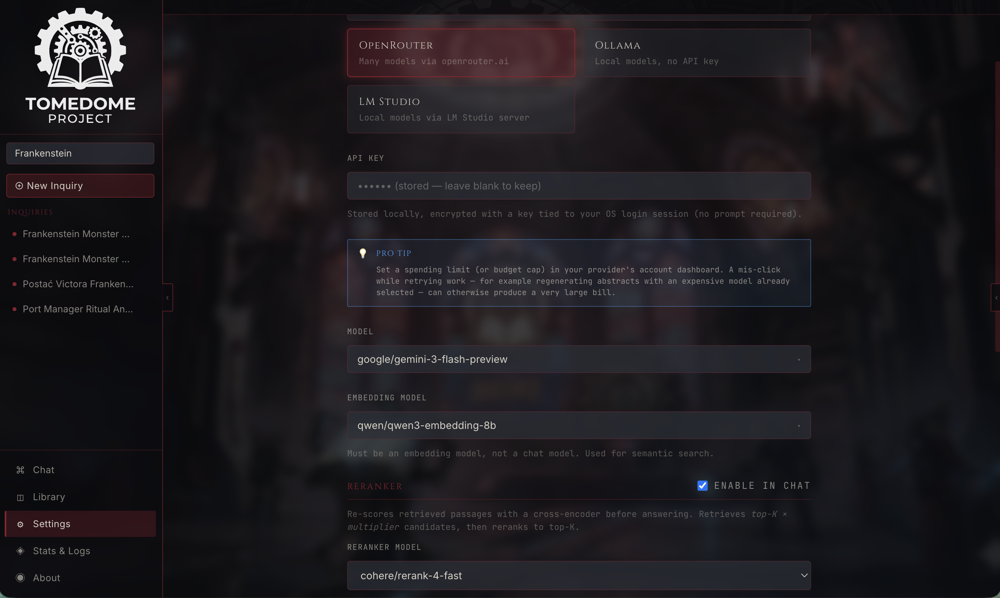
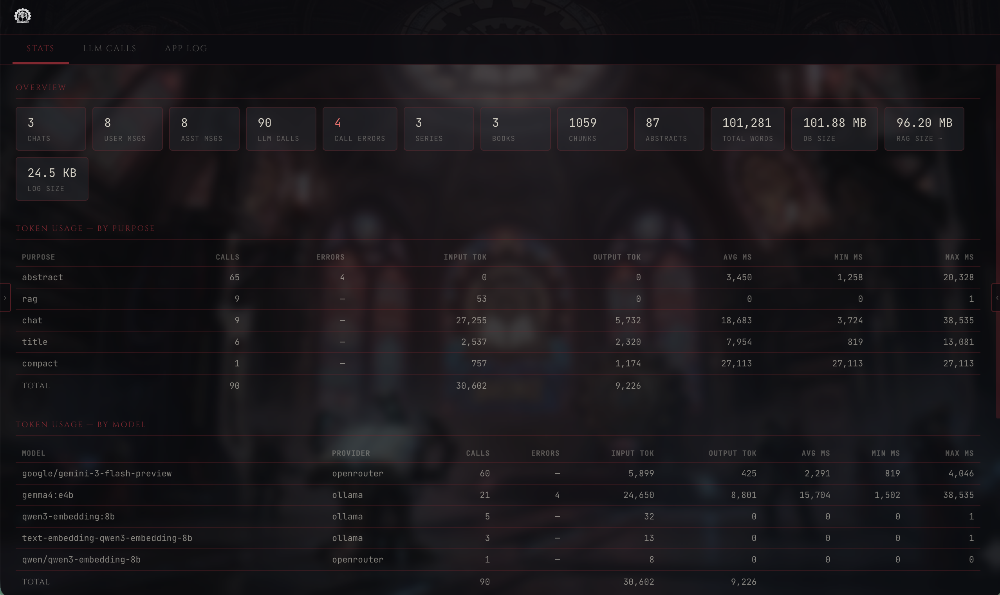
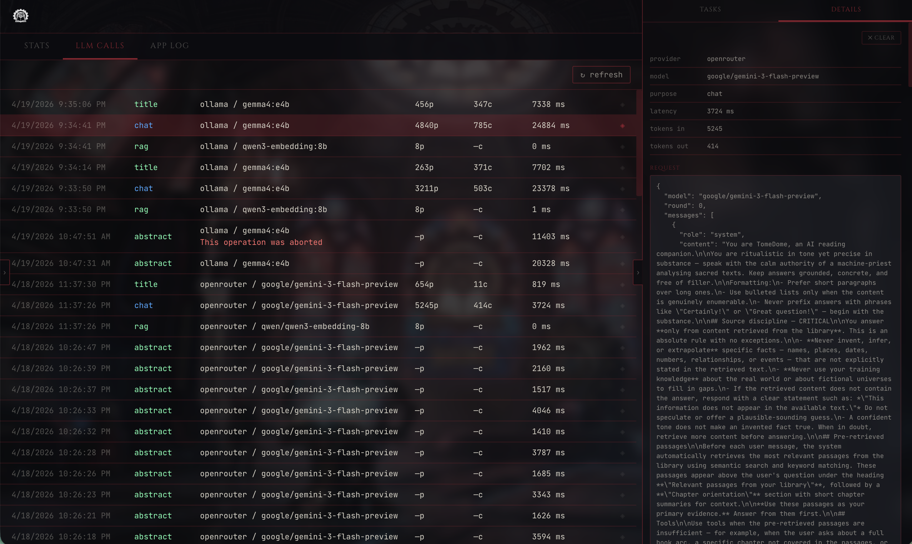

# TomeDome

<p align="center">
  <a href="LICENSE"></a>
  <a href="https://www.electronjs.org/"></a>
  <a href="https://www.typescriptlang.org/"></a>
  <a href="https://react.dev/"></a>
  
</p>

<p align="center">
  
</p>

**AI Reading Companion for long book series.**

TomeDome is a privacy-first desktop application that acts as an AI-powered
reading companion for your personal library. Upload your books, process them
locally, and have a conversation with an AI that understands the full context
of a series — characters, plot threads, recurring themes, and literary
devices — while respecting how far you've read.

## Why I built this

Long fantasy runs—*Wheel of Time*, *Malazan Book of the Fallen*, that kind of
thing—are great until life gets in the way. I’ll pause for a few weeks or
months, or bounce to another book, then come back and realise I’ve lost the
thread: where did the last volume leave off, and where does this one pick up the
plot? Malazan makes it worse—one book continues a storyline from two volumes
back while another shifts the whole action to another continent, so “what am I
even reading right now?” is a real question.

While I read, small doubts pile up too: *have I seen this name before, or is it
just someone who sounds familiar?* There’s often no one around who’s on the
same book at the same time, and random Reddit threads are a lottery for
spoilers and noise, not answers.

TomeDome is my answer to that: a calm place to anchor *where I am* in a series,
what happened last, and the loose threads I care about—so getting back into a
huge saga feels less like homework and more like slipping back into the story.

## What it does

- **Series catch-up** — summaries of previous books or the whole series up to a
  given point, so you can resume reading without re-reading.
- **Conversational exploration** — ask open-ended questions about the series
  in a chat interface.

## Screenshots

Chat with retrieval context and **tool use** (e.g. reading chapter abstracts on demand):



<details>
<summary><strong>More screenshots</strong> — library, settings, abstracts, RAG inspector, …</summary>

### Library



### Landing page


### Chat



### Abstract generation



### Chunking



### RAG inspector



### Settings



### Stats



### Logs



</details>

## Design principles

- **Privacy first.** All book content stays on your machine. Nothing is
  uploaded to any cloud service by TomeDome itself.
- **Bring your own LLM.** Configure your own API key (Anthropic, OpenAI,
  OpenRouter) or run a local model via Ollama for a fully offline experience.
- **Reader-scoped knowledge.** TomeDome never knows more than you do —
  summaries, character analysis, and insights are always filtered to your
  current position in a series. You can control what books are in scope. 
- **Readonly LLM tool.** The model only retrieves and reasons over your
  library—it does not run arbitrary instructions from book text or chat as
  system commands. That boundary limits what embedded “prompt injection” in a
  novel could do: misleading prose cannot hijack the app or your data the way
  it could if the LLM could freely act on untrusted text.
- **No ingestion guard-rail LLM (by design).** Because there are no
  read–write or side-effect tools for the model, we do **not** plan a separate
  policy or safety pass over book text at ingest—it would add cost and latency
  for little gain. The remaining surface is still small: the only way the
  model reaches you is **chat output**, which you can ignore or discard like any
  untrusted assistant text.

## Installation

Download the installer for your platform from the Releases page:

- **macOS** — `TomeDome-<version>.dmg`
- **Windows** — `TomeDome-Setup-<version>.exe`
- **Linux** — `TomeDome-<version>.AppImage` or `.deb`

On first launch, the app will walk you through configuring an LLM provider
(API key or local Ollama URL). All book data, configuration, and logs are
stored in your user data directory:

- macOS: `~/Library/Application Support/TomeDome/`
- Windows: `%APPDATA%/TomeDome/`
- Linux: `~/.config/TomeDome/`

No cloud account is required and no telemetry is collected.

## Development

### Prerequisites

- Node.js **22+** (or any version supporting the bundled Electron runtime)
- npm **10+**

### Setup

```bash
git clone https://github.com/<you>/TomeDome.git
cd TomeDome
npm install
```

The `postinstall` step rebuilds `better-sqlite3` against the Electron Node
headers — expect that to take a minute on a clean install.

**Sample Markdown books** for testing import live in [`book_example/`](book_example/):
[pl_book.md](book_example/pl_book.md),
[the_incident_report_plan.md](book_example/the_incident_report_plan.md).

### First push (new remote)

After your initial commit:

```bash
git remote add origin https://github.com/<you>/TomeDome.git
git branch -M main
git push -u origin main
```

Skip `git remote add` if the remote already exists.

### Run locally

```bash
npm run dev
```

This starts the Vite dev server (with HMR for the React renderer), launches
Electron, and boots the embedded Fastify backend on a dynamically chosen
localhost port. On first launch you'll be redirected to the Settings page —
pick a provider, paste an API key (or leave blank for Ollama), pick a model,
hit **Test Connection**, then **Save**.

### Other scripts

```bash
npm run typecheck    # tsc across main, preload, and renderer configs
npm run build        # production build to out/
npm run start        # preview the production build locally
npm run format       # prettier across src/
```

### Project layout

```
src/
  main/          # Electron main process + Fastify backend + SQLite
  preload/       # contextBridge — exposes getBackendPort() to renderer
  renderer/      # React app (Vite), HashRouter, CSS Modules
    src/
      themes/    # Skinnable theming: contract + techno-gothic theme
      components/layout/   # 3-panel AppShell, Sidebar, RightPanel, TopBar
      components/settings/ # Settings page (LLM provider config)
      pages/     # Route placeholders
  shared/        # Types shared between main and renderer
docs/    # Full product specification
licenses/        # Redistributed font license texts (SIL OFL)
```


### Tech stack

- **Electron** desktop shell
- **TypeScript** across main, preload, and renderer
- **React 18** + **react-router-dom v7** (HashRouter)
- **Fastify 5** embedded HTTP backend on localhost
- **better-sqlite3** for local metadata, config, and (later) book data
- **pino** structured logging
- **Vite** (via `electron-vite`) for bundling

## Roadmap

Planned and in-flight work:

- **Reader-scoped filtering** — Narrow RAG and answers by reading progress: exclude whole books or individual chapters from context while still respecting spoiler boundaries for what you have not read.
- **Full-text search as a tool** — Expose SQLite FTS (or equivalent) as an LLM-callable tool for precise lexical lookups alongside embedding retrieval.
- **Entity resolution and wiki** — Combine LLM-based named-entity extraction with fuzzy matching (e.g. Levenshtein) to merge aliases and typos into a stable entity dictionary or in-app wiki.
- **Theme support** — Multiple UI themes beyond the current skinnable default (consistent with the theme contract under `src/renderer/src/themes/`).
- **Log rotation with preserved stats** — Rotate log files without losing aggregate diagnostics (retain roll-up metrics or summaries across rotations).
- **Model evaluation benchmark (synthetic book)** — Regression harness using a [synthetic book and golden Q/A set](docs/synthetic-book-evaluation.md) so scores reflect retrieval and grounding, not memorized training data; includes end-to-end and retrieval-only metrics (see that doc).
- **Automated tests** — `npm test` (or CI) covering core backend services, ingestion/RAG paths where practical, and critical renderer logic; headless-friendly where possible (see [CONTRIBUTING.md — Testing](CONTRIBUTING.md#8-testing)).

## Author

**Szymon Kuliński** — <https://github.com/pulina>

## License

MIT — see [LICENSE](LICENSE).

Bundled fonts (Cinzel, Inter, JetBrains Mono) are redistributed under the
**SIL Open Font License 1.1**; their license texts are preserved in
[licenses/fonts/](licenses/fonts/).
